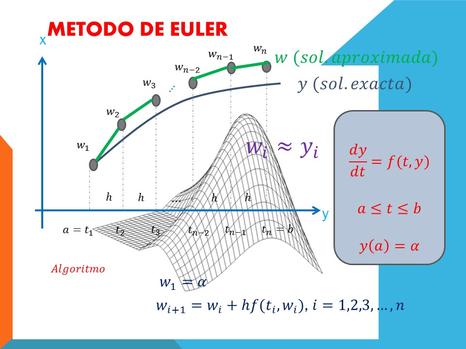

## Ejercicio - Método de Euler para resolver una Ecuación diferencial

Este repositorio muestra un ejemplo de programación en Python para resolver una Ecuación Diferencial por el método de Euler-Cauchy

**NOTA:** Esta plantilla **no está diseñada para pruebas locales ni para Autograding**.
